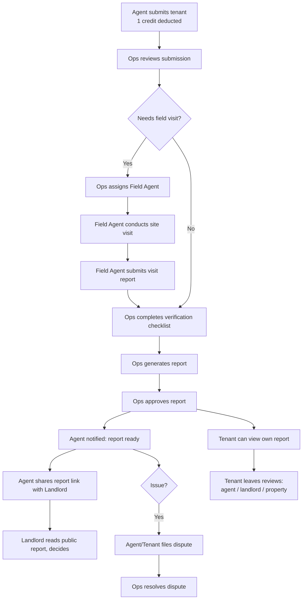
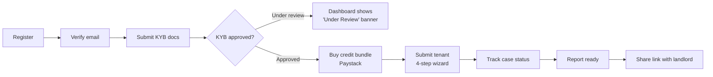
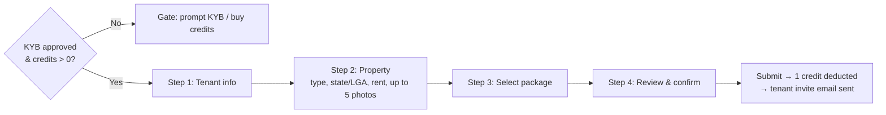
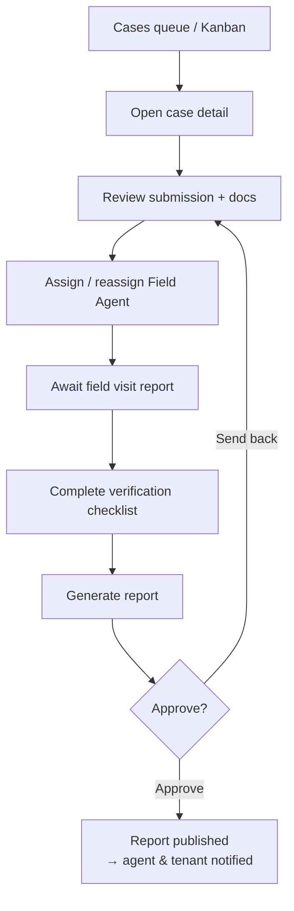
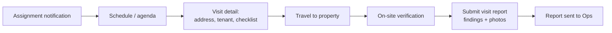
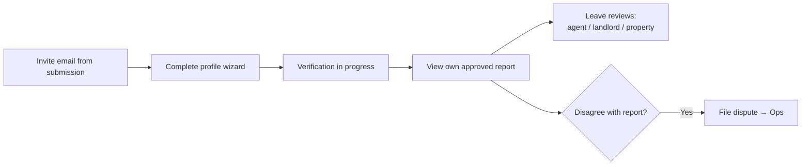
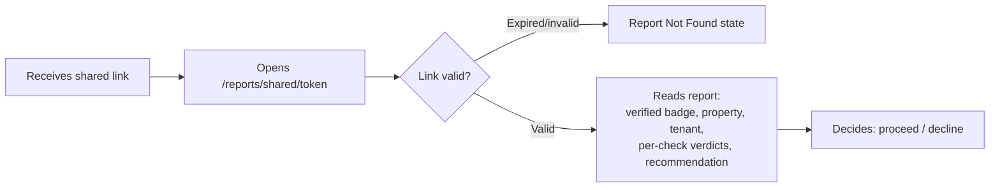

# RentCred — User Flows & Journeys

> The key end-to-end journeys, as flow diagrams + narration. Use these to design connected
> experiences (not isolated screens), to place CTAs, and to design the transition/handoff moments
> between roles. Diagrams are Mermaid (render in any Mermaid-aware viewer).

---

## 1. The master lifecycle (all roles)

---

## 2. Agent onboarding → first report (primary activation journey)

**Design notes**
- The **KYB → credits → submit** chain is the activation funnel. Every gate must show the *next*
  action, not just a block. The dark KYB banner is the recurring nudge.
- The submit wizard's final **review step** is the last moment before a credit is spent — make the
  cost and what's being purchased unmistakable.
- "Report ready" → "Share" should be one tap; sharing is the agent's payoff moment.

---

## 3. Submit-tenant wizard (4 steps)

**Design notes:** persistent step progress; per-step validation with forgiving inline errors; photo
uploader with thumbnails + remove; a clear cost summary on the review step; mobile-first (most agents
submit on a phone).

---

## 4. Ops case processing (throughput journey)

**Design notes:** Ops is desktop, queue-driven. Optimize for **triage speed** — scannable statuses,
filters/tabs, bulk awareness of SLA, and a case-detail page that exposes the right action for the
current status (assign vs checklist vs generate vs approve). The Kanban view is the spatial
alternative to the table.

---

## 5. Field agent visit journey (mobile-first)

**Design notes:** everything reachable with one thumb; address prominent (consider map/Maps link);
the submit form should be checklist-shaped with photo capture; tolerant of poor connectivity
(autosave/draft if possible).

---

## 6. Tenant journey (low-frequency, trust-sensitive)

**Design notes:** the tenant arrives cold from an email — orient them quickly and reassure on
privacy (NDPR). The report view should help them *understand* their result. Reviews and disputes are
optional, low-pressure.

---

## 7. Landlord journey (non-user — public report)

**Design notes:** this is the **conversion moment of the whole product** and the only touchpoint for
a landlord. ~30 seconds to establish trust: RentCred attribution, "Verification Complete" badge,
scannable verdicts, an unambiguous recommendation. Must look credible with zero prior context, work
on mobile, and be print/PDF-friendly. Design the expired-link state with equal care.

---

## 8. Cross-role handoff moments (design these seams carefully)
| Handoff | From → To | What must be clear |
|---------|-----------|--------------------|
| Submission | Agent → Ops | New case appears in queue with all context |
| Assignment | Ops → Field Agent | Notification + everything needed to do the visit |
| Visit report | Field Agent → Ops | Findings feed the checklist/report |
| Approval | Ops → Agent & Tenant | "Report ready" notification + access |
| Share | Agent → Landlord | Public link that stands alone |
| Invite | Submission → Tenant | Email that explains why and what to do |
| Dispute | Agent/Tenant → Ops | Context + status updates to all parties |
